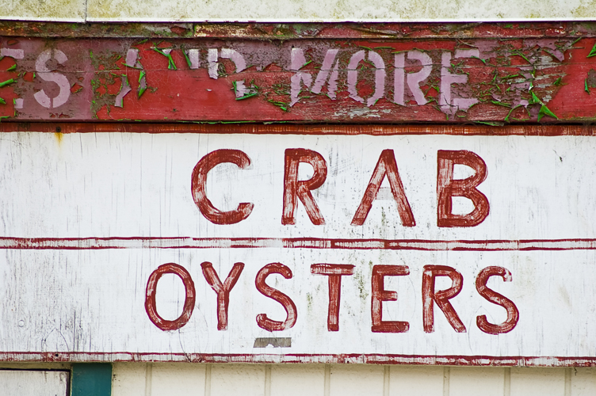
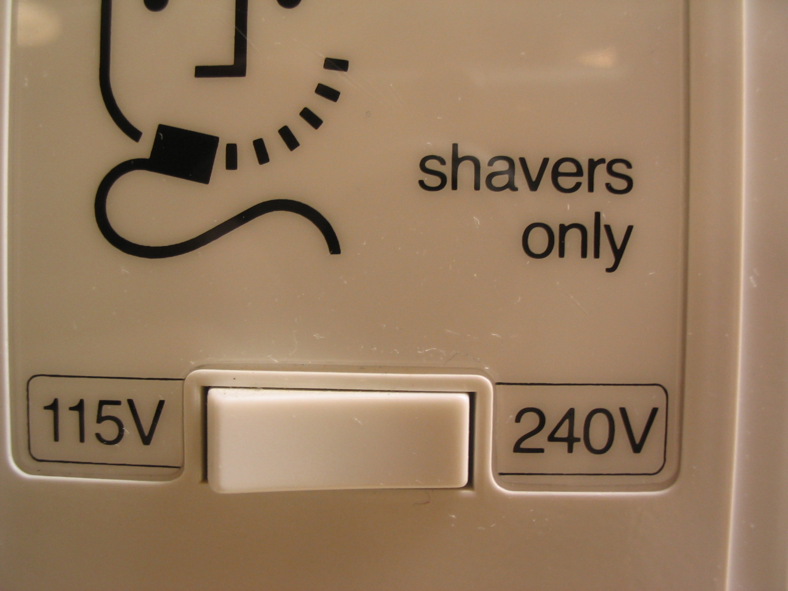
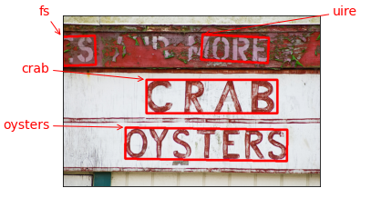
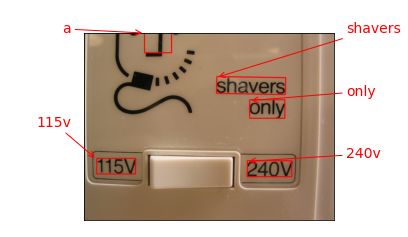
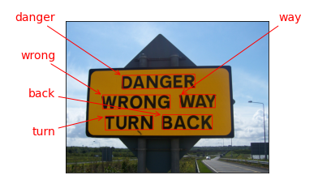
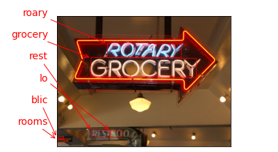

`*Today's Topic is OCR *
optical character recognition`
    
means visualize and get tex

There are varuious approches for ocr in the tutorial we focus on the ocr from pre-trained model of keras - tensorflow as it is easy to *use*

ocr is composed of mainly two processes

character detection
character recognition

character detection means you have to first highlight the region of interest in an image. the region of intrest consists of character, yet we only detect the character but we don't know which of them character is what?

character recognition means the model further investigate in the region of interest to recognize the characters, it is a process of object recognition

they both comes under computer vision domain.

keras has a pre-trained OCR model we can get them by either pip install git+https://github.com/faustomorales/keras-ocr.git#egg=keras-ocr or pip install keras-ocr

sample images

with OCR
  

  

